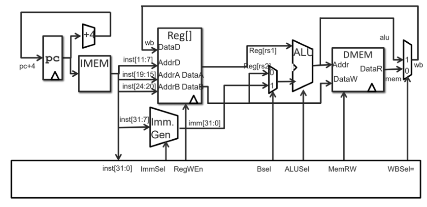

# RISC-V Single-Cycle Processor

## Overview
This repository contains a VHDL implementation of a single-cycle RISC-V processor, designed to demonstrate fundamental computer architecture concepts. The processor executes a subset of RISC-V instructions, including R-type (ADD, SUB, AND, OR) and I-type (ADDI, ANDI, ORI, LW, SW), in a single clock cycle. The modular design ensures clarity and functionality, making it ideal for educational purposes.


## Features
- **Single-Cycle Architecture**: Executes each instruction in one clock cycle for simplicity and transparency.
- **Core Components**:
  - **Program Counter (PC)**: Manages 6-bit instruction addresses.
  - **Instruction Memory**: 64-byte ROM storing up to 16 32-bit instructions (Little Endian, byte-addressable).
  - **Register File**: 32 registers (32-bit), supporting dual-read and single-write operations.
  - **ALU**: Performs ADD, SUB, AND, OR operations on 32-bit operands.
  - **Immediate Generator**: Extracts and sign-extends I-type and S-type immediates.
  - **Data Memory**: 128-byte byte-addressable memory for load/store operations.
  - **Control Unit**: Decodes instructions and generates precise control signals.
- **Supported Instructions**: R-type (ADD, SUB, AND, OR), I-type (ADDI, ANDI, ORI), and memory operations (LW, SW).
- **Simulation**: Extensively tested with testbenches to verify functionality across arithmetic, logical, and memory operations.

## Code Structure
The processor's data path and control signals are orchestrated through the following key components and signals:
- **Components**:
  - `pc`: Program Counter, managing instruction addresses.
  - `imem`: Instruction Memory, storing 32-bit instructions.
  - `reg`: Register File, handling 32 registers for data storage.
  - `dmem`: Data Memory, supporting load/store operations.
  - `alu`: Arithmetic Logic Unit, performing arithmetic and logical operations.
  - `imm`: Immediate Generator, extracting and extending immediate values.
  - `gen`: Control signal generation for instruction decoding.
- **Control Signals**:
  - `add`: Addition operation for ALU.
  - `addr`: Address input for memory operations.
  - `data`: Data input/output for memory and registers.
  - `sel`: Select signal for multiplexers.
  - `w`: Write enable for registers and memory.
  - `bsel`: Selects ALU second operand (register or immediate).
  - `alusel`: Selects ALU operation (ADD, SUB, AND, OR).
  - `memrw`: Memory read/write control (0=read, 1=write).
  - `wbsel`: Write-back source selection (ALU or memory).
  - `inst`: 32-bit instruction input to control unit.
  - `regwen`: Register write enable signal.
These signals and components are interconnected in the `TopCPU` module, ensuring a cohesive single-cycle execution path.

## Project Structure
- **src/**: VHDL source files for all modules (PC, Instruction Memory, Register File, ALU, Immediate Generator, Data Memory, Control Unit, TopCPU).
- **testbenches/**: Testbenches for module and system validation.
- **docs/**: Documentation, including block diagrams and simulation waveforms.
- **media/**: Images and diagrams from the project report.

## Getting Started
### Prerequisites
- VHDL simulator (e.g., ModelSim, GHDL, or Vivado)
- Familiarity with RISC-V architecture and VHDL

### Installation
1. Clone the repository:
   ```bash
   git clone https://github.com/yourusername/risc-v-single-cycle-processor.git
   ```
2. Navigate to the project directory:
   ```bash
   cd risc-v-single-cycle-processor
   ```
3. Open the VHDL files in your simulator.

### Running Simulations
1. Compile VHDL files in the `src/` directory.
2. Run testbenches from the `testbenches/` directory.
3. Analyze waveforms to verify correct operation (e.g., register updates, ALU results, memory access).

## Simulation Results
The processor was validated with four test cases:
1. **Arithmetic Test**: ADDI and ADD instructions correctly updated registers (e.g., x5 = 22 from x1 + x2 + x3).
2. **Logical Test**: AND and OR operations produced expected results (e.g., x3 = 8, x4 = 14).
3. **Immediate Test**: ADDI, ANDI, and ORI handled immediate values accurately.
4. **Load/Store Test**: SW and LW operations correctly stored and retrieved data from memory.
Waveforms confirm immediate register updates, accurate control signals, and hazard-free execution, validating the design's correctness.

## Limitations
- **Single-Cycle Design**: Simple but not optimized for complex applications.
- **Instruction Set**: Limited to a subset of RISC-V instructions (no branch/jump support).
- **Memory Size**: Fixed at 64 bytes (instruction) and 128 bytes (data).

## Future Improvements
- Add branch and jump instruction support.
- Transition to a pipelined architecture for better performance.
- Expand memory and instruction set for enhanced functionality.

## Contributing
Contributions are welcome! Fork the repository, create a branch, and submit a pull request with your changes.
